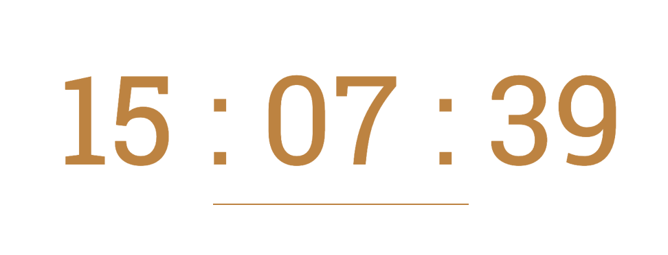

# Таймер обратного отсчета

Этот таймер позволяет отображать оставшееся время до указанного дедлайна в формате `ЧЧ:ММ:СС`. Если дедлайн уже прошел, таймер показывает `00:00:00`.

---

## Установка и использование

### 1. Подключение HTML

Добавьте следующий код в вашу HTML-страницу:

```html
<div class="timer">
	<div class="timer-action">До конца акции осталось</div>
	<div
		class="timer-numbers"
		id="timer">
		<span class="hours"></span>
		<span>:</span>
		<span class="minutes"></span>
		<span>:</span>
		<span class="seconds"></span>
	</div>
</div>
```

### 2. Подключение JavaScript

```
// Передаем дедлайн
let deadline = '2025-01-25';

// Функция для вычисления оставшегося времени и расчета секунд, минут, часов
const getTimeRemaining = (endTime) => {
    let milliseconds = Date.parse(endTime) - Date.parse(new Date());
    let seconds = Math.floor((milliseconds / 1000) % 60).toString().padStart(2, '0');
    let minutes = Math.floor((milliseconds / 1000 / 60) % 60).toString().padStart(2, '0');
    let hours = Math.floor((milliseconds / 1000 / 60 / 60)).toString().padStart(2, '0');

    if (Date.parse(new Date()) >= Date.parse(endTime)) {
        seconds = '00';
        minutes = '00';
        hours = '00';
    }

    return {
        'total': milliseconds,
        'seconds': seconds,
        'minutes': minutes,
        'hours': hours,
    }
}

// Установка таймера
const setClock = (id, endTime) => {
    const timer = document.getElementById(id);
    const hours = timer.querySelector('.hours');
    const minutes = timer.querySelector('.minutes');
    const seconds = timer.querySelector('.seconds');

    const timeInterval = setInterval(updateClock, 1000);

    function updateClock() {
        let time = getTimeRemaining(endTime);
        hours.textContent = time.hours;
        minutes.textContent = time.minutes;
        seconds.textContent = time.seconds;

        if (time.total <= 0) {
            clearInterval(timeInterval);
        }
    }
}

setClock('timer', deadline);
```

#### Параметры

    - deadline — строка с датой и временем дедлайна в формате YYYY-MM-DD.
    - id — ID родительского элемента в HTML, где будет отображаться таймер.
    - Если нужно учитывать дни, добавьте соответствующий расчет в функцию getTimeRemaining (закомментированные строки в main.js и index.html).

### 3. Подключение стилей

Используйте ваши собственные стили или добавьте CSS для оформления таймера.

### Пример


